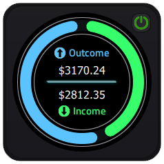

# QML Component Collection with PySide2 and Qt5



## Overview

This repository contains a curated collection of QML components designed with PySide2 and Qt5. The components showcase a range of functionalities and are suitable for various application scenarios. This collection requires Python 3 or higher and utilizes the capabilities of Qt5 to provide a sleek and modern user interface.

Currently, this repository is under development, more components will be added soon

## Prerequisites

Before you begin, ensure you have the following prerequisites installed on your system:

- Python 3.x: The codebase is compatible with Python 3 and above. You can download the latest version of Python [here](https://www.python.org/downloads/).
- Git: You will need Git to clone the repository. If you don't have Git installed, follow the instructions [here](https://git-scm.com/book/en/v2/Getting-Started-Installing-Git).

## Getting Started

To get started with these QML components, follow these steps:

### 1. Clone the Repository

Open your terminal and run the following command to clone the repository:

1. **Clone the Repository**

   ```bash
   git clone https://github.com/davidcastagnetoa/componentsCollection.git
   ```

2. **Set Up Virtual Environment (Optional, but Recommended)**

   ```bash
   cd componentsCollection
   python -m venv venv
   source venv/bin/activate # On Windows, use venv\Scripts\activate
   ```

3. **Install Dependencies**

   ```bash
   pip install PySide2
   ```

4. **Run the Application**

   ```bash
   python main.py
   ```

## Contributing

Contributions to this collection are welcome! Please read our contributing guidelines to learn how you can contribute to this project.

## License

This project is licensed under the MIT License. See the LICENSE file for more details.

## Support

If you encounter any problems or have any queries regarding the usage of these components, please open an issue in the repository.

I hope you find these QML components helpful in your projects!
